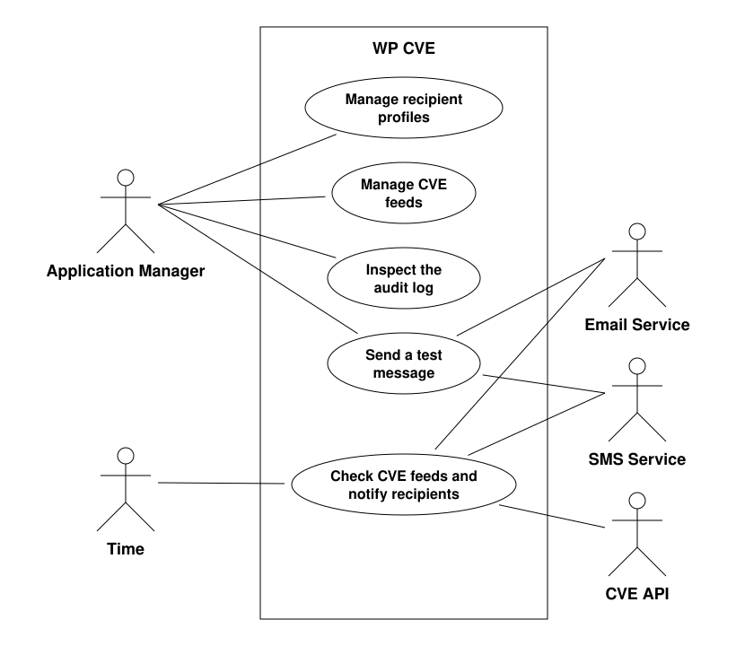

# WP CVE product scope

## Product boundary

## Product use cases

| Use case | Name | Actors | Feature files |
|---|---|---|---|
| PUC-1 | Manage recipient profiles | Application manager | [recipient_management.feature](features/recipient_management.feature) |
| PUC-2 | Manage CVE feeds | Application manager | [cve_feeds.feature](features/cve_feeds.feature) |
| PUC-3 | Check CVE feeds and notify recipients | Time, CVE API, email service, SMS service | [cve_notifications.feature](features/cve_notifications.feature), [delivery.feature](features/delivery.feature), [audit_log.feature](features/audit_log.feature), [cve_feeds.feature](features/cve_feeds.feature) |
| PUC-4 | Send a test message | Application manager, email service, SMS service | [test_message.feature](features/test_message.feature) |
| PUC-5 | Inspect the audit log | Application manager | [audit_log.feature](features/audit_log.feature) |

### PUC-1 Manage recipient profiles

- **Trigger:** an application manager adds, edits or removes a recipient profile.
- **Actors:** application manager.
- **Precondition:** the user is logged in as an application manager.
- **Outcome:** the recipient profile is saved, updated or removed, and the information of the recipient is stored and removed in a GDPR friendly way. A recipient profile that is the only profile assigned to a CVE feed cannot be removed. Users who are not logged in as an application manager are denied these actions.

### PUC-2 Manage CVE feeds

- **Trigger:** an application manager creates a CVE feed or assigns a recipient profile to a CVE feed.
- **Actors:** application manager.
- **Precondition:** the user is logged in as an application manager.
- **Outcome:** the CVE feed is saved with one CPE name and either one or two recipient profiles. A CPE name of which the part, vendor, product or version component is `*` is rejected.

### PUC-3 Check CVE feeds and notify recipients

- **Trigger:** the scheduled time to poll the CVE feeds is reached.
- **Actors:** time, CVE API, email service, SMS service.
- **Precondition:** at least one CVE feed is configured.
- **Outcome:** the results of each CVE feed are retrieved from the CVE API in pages, using `startIndex` and `resultsPerPage`, until the whole collection has been retrieved. A vulnerability notification for each CVE that matches the CPE name of a CVE feed and has not been reported previously is sent to every recipient profile assigned to that CVE feed, through the channels to which the recipient profile is subscribed. Every delivery attempt, whether successful or failed, is recorded in the audit log. A CVE that matches no configured CVE feed is not sent to any recipient.

### PUC-4 Send a test message

- **Trigger:** an application manager sends a test message to a recipient profile.
- **Actors:** application manager, email service, SMS service.
- **Precondition:** the user is logged in as an application manager, and the recipient profile exists.
- **Outcome:** the test message is delivered through the same email and SMS services as a vulnerability notification. The test message lists the CVE feeds to which the recipient profile is assigned, and it is recorded in the audit log, marked as a test message.

### PUC-5 Inspect the audit log

- **Trigger:** an application manager opens the audit log.
- **Actors:** application manager.
- **Precondition:** the user is logged in as an application manager.
- **Outcome:** the delivery status of past notifications is presented to the application manager.
